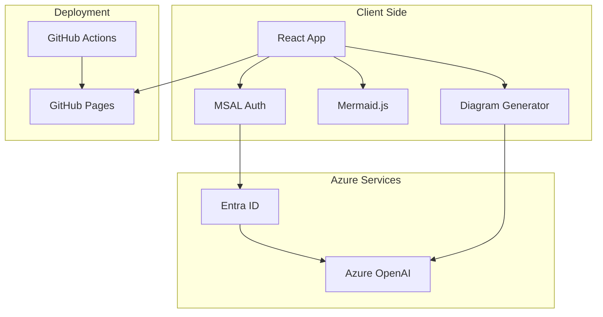

# Mermaid Diagram Generator

A React-based static site that allows users to create Mermaid diagrams using natural language descriptions. The application integrates with Azure OpenAI Service and uses Entra ID (Azure AD) for authentication.

## Features

- **Natural Language Input**: Describe diagrams in plain English
- **Multiple Diagram Types**: Support for flowcharts, sequence diagrams, class diagrams, state diagrams, ER diagrams, and Gantt charts
- **Dual AI Integration**: Primary Azure OpenAI Service with OpenAI API fallback option
- **Secure Authentication**: Entra ID (Azure AD) authentication with MSAL
- **Export Options**: Export diagrams as PNG, SVG, or HTML
- **Responsive Design**: Works on desktop and mobile devices
- **Split-View Interface**: Text input on the left, diagram preview on the right
- **Fallback Support**: Configure your own OpenAI API key when Azure OpenAI is unavailable
- **Diagram History**: Navigate through previous diagrams with undo/redo functionality

## Architecture Diagram



## Technology Stack

- **Frontend**: React 18 with TypeScript
- **Build Tool**: Vite
- **Authentication**: MSAL (Microsoft Authentication Library)
- **Diagram Rendering**: Mermaid.js
- **AI Integration**: Azure OpenAI Service
- **Deployment**: GitHub Actions + GitHub Pages
- **Styling**: CSS Grid and Flexbox

## Getting Started

### Prerequisites

- Node.js 18 or higher
- Azure AD tenant with app registration
- Azure OpenAI Service instance

### Installation

1. Clone the repository:
```bash
git clone <repository-url>
cd merdit
```

2. Install dependencies:
```bash
npm install
```

3. Set up environment variables:
```bash
cp .env.example .env
```

4. Configure your `.env` file with your Azure credentials:
```env
REACT_APP_CLIENT_ID=your-azure-ad-client-id
REACT_APP_TENANT_ID=your-azure-ad-tenant-id
REACT_APP_REDIRECT_URI=http://localhost:5173
REACT_APP_API_SCOPE=api://your-api-scope/access_as_user
REACT_APP_API_BASE_URL=https://your-azure-openai-instance.openai.azure.com
```

5. Start the development server:
```bash
npm run dev
```

## Azure Setup

### Azure AD App Registration

1. Go to Azure Portal > Azure Active Directory > App registrations
2. Create a new registration with:
   - Name: "Mermaid Diagram Generator"
   - Supported account types: Accounts in this organizational directory only
   - Redirect URI: Single-page application (SPA) - http://localhost:5173
3. Note the Application (client) ID and Directory (tenant) ID
4. Configure API permissions if needed

### Azure OpenAI Service

1. Create an Azure OpenAI resource in Azure Portal
2. Deploy a GPT model (e.g., GPT-4 or GPT-3.5-turbo)
3. Note the endpoint URL and API key
4. Configure authentication scopes

## Usage

1. **Authentication**: Sign in with your Microsoft account
2. **Configure Fallback (Optional)**: Click the "🔑 Add API Key" button to configure OpenAI API as a fallback
3. **Create Diagrams**: Enter a description of your diagram in the left panel
4. **Generate**: Click "Generate Diagram" to create your diagram
5. **Export**: Use the export buttons to download as PNG, SVG, or HTML
6. **Iterate**: Modify your description and regenerate as needed

### Fallback Configuration

If Azure OpenAI Service is unavailable, you can configure your own OpenAI API key:

1. Click the "🔑 Add API Key" button in the input panel
2. Enter your OpenAI API key (starts with `sk-`)
3. Optionally modify the API URL (defaults to `https://api.openai.com/v1`)
4. Click "Save & Continue"

The app will automatically try the fallback when Azure OpenAI is unavailable. Your API key is stored securely in your browser's local storage.

**CORS Setup:** Due to browser security restrictions, you may need to set up a proxy to use OpenAI API. See [OPENAI_SETUP.md](./docs/OPENAI_SETUP.md) for detailed instructions. The app provides multiple setup options including a local proxy server.

### Diagram History

The application automatically saves your diagram history:

- **Navigation**: Use "← Previous" and "Next →" buttons to navigate through your diagram history
- **History Indicator**: Shows current position (e.g., "2 of 5")
- **Auto-Save**: Each successfully generated diagram is automatically saved
- **Clear History**: Remove all saved diagrams with the "🗑️ Clear" button
- **Capacity**: Keeps the last 10 diagrams in memory

History is preserved during your session and includes both the prompt and generated diagram.

### Example Prompts

- "Create a flowchart showing the user login process with email validation"
- "Show how our web app, database, and cache interact"
- "Create a sequence diagram for API authentication flow"
- "Generate an ER diagram for a blog database"

## Deployment

The application is deployed using GitHub Actions to GitHub Pages:

1. Push to the main branch
2. GitHub Actions builds the application
3. Deploys to GitHub Pages automatically

### GitHub Secrets

Configure these secrets in your GitHub repository:

- `REACT_APP_CLIENT_ID`
- `REACT_APP_TENANT_ID`
- `REACT_APP_REDIRECT_URI`
- `REACT_APP_API_SCOPE`
- `REACT_APP_API_BASE_URL`

## Development

### Project Structure

```
src/
├── components/
│   ├── DiagramGenerator.tsx    # Main diagram generation component
│   ├── LoginButton.tsx         # Authentication login button
│   └── LogoutButton.tsx        # Authentication logout button
├── authConfig.ts               # MSAL configuration
├── App.tsx                     # Main application component
├── App.css                     # Application styles
└── main.tsx                    # Application entry point
```

### Available Scripts

- `npm run dev` - Start development server
- `npm run build` - Build for production
- `npm run preview` - Preview production build
- `npm run lint` - Run ESLint

## Contributing

1. Fork the repository
2. Create a feature branch
3. Commit your changes
4. Push to the branch
5. Create a Pull Request

## License

This project is licensed under the MIT License.

## Documentation

- [CLAUDE.md](./docs/CLAUDE.md) - Development guidelines and project-specific instructions
- [QUICK_START.md](./docs/QUICK_START.md) - Quick start guide for getting up and running
- [PROJECT_SUMMARY.md](./docs/PROJECT_SUMMARY.md) - Detailed project summary and architecture
- [OPENAI_SETUP.md](./docs/OPENAI_SETUP.md) - OpenAI API setup and CORS configuration

## Support

For issues and questions, please create an issue in the GitHub repository.